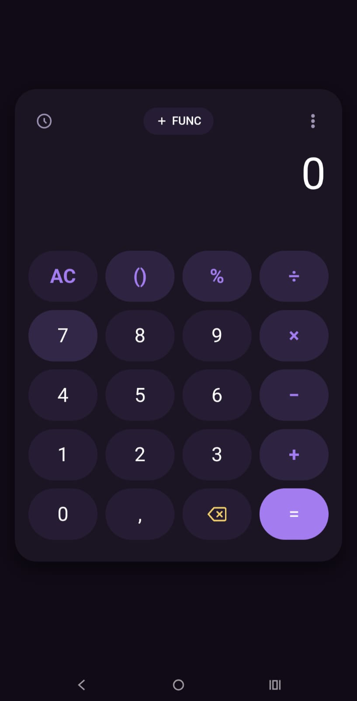
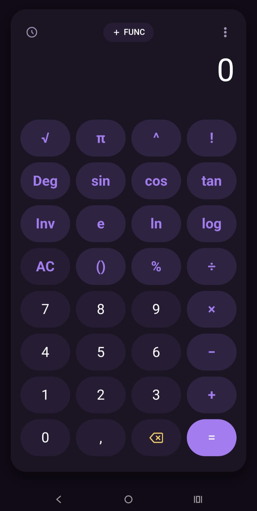
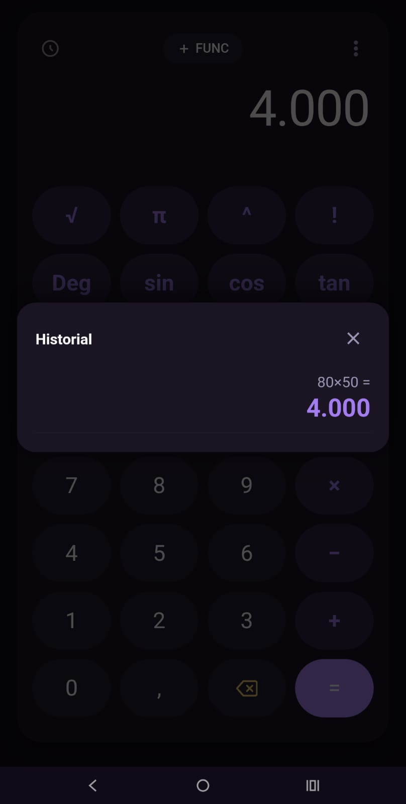

# Calculadora Pro

Una calculadora científica y estándar con un diseño moderno, minimalista y completamente centrada en la privacidad de los usuarios. Desarrollada con tecnologías web libres y adaptada a una experiencia nativa para Android mediante **Apache Cordova**.

Esta aplicación no recopila datos, no requiere conexión a internet y opera localmente, garantizando total transparencia y respeto por tu privacidad.

## Características Principales

* **Modo Estándar y Científico:** Funciones trigonométricas, raíces, potencias y logaritmos accesibles con un solo botón.
* **Temas Personalizables:** Interfaz adaptable con soporte para temas claros y oscuros.
* **Historial de Cálculos:** Guarda tus operaciones previas con facilidad para consultarlas o borrarlas en cualquier momento.
* **100% Offline:** No requiere internet para funcionar ni solicita permisos innecesarios del sistema.
* **Software Libre:** Licenciada bajo términos abiertos para su revisión y distribución.

## Capturas de Pantalla

| Vista Estándar | Modo Científico | Historial de Cálculos |
| :---: | :---: | :---: |
|  |  |  |

## Cómo Compilar la Aplicación (F-Droid & Local)

Para construir el contenedor nativo de Android sin depender de entornos pesados de desarrollo, este proyecto utiliza herramientas de línea de comandos estándar de **Apache Cordova**.

### Requisitos Previos
* Node.js (versión LTS recomendada)
* Cordova CLI instalado de forma global
* Android SDK Command-line Tools (para compilación local en máquina)

### Instrucciones de Construcción

```bash
# 1. Instalar el gestor de Cordova globalmente
npm install -g cordova

# 2. Clonar el repositorio
git clone [https://github.com/TU-USUARIO/calculadora-pro.git](https://github.com/TU-USUARIO/calculadora-pro.git)
cd calculadora-pro

# 3. Añadir la plataforma Android
cordova platform add android

# 4. Preparar y construir el archivo APK
cordova prepare android
cordova compile android --release